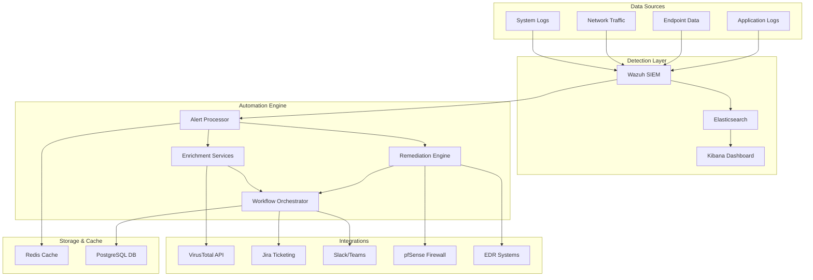
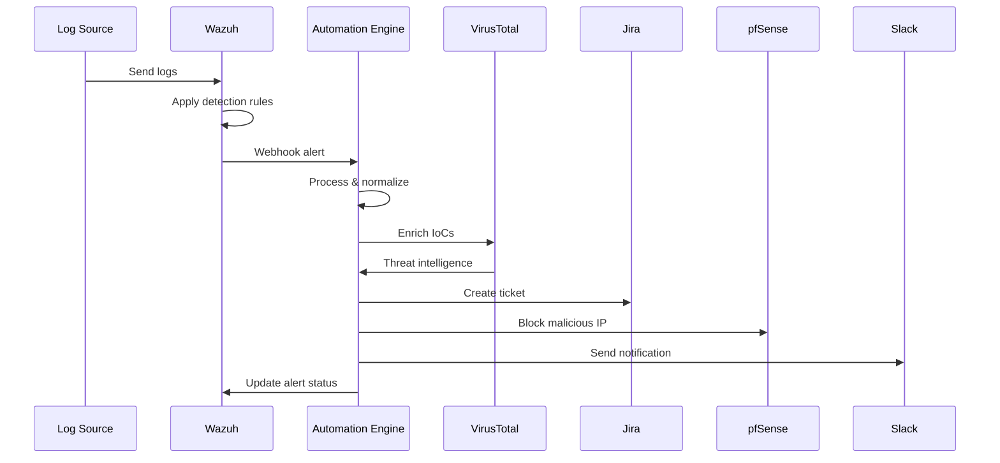

# Detection & Automation Lab - Architecture Overview

## System Architecture

The Detection & Automation Lab is designed as a comprehensive Security Operations Center (SOC) automation platform that demonstrates end-to-end threat detection, enrichment, and response capabilities.

## Component Overview

### 1. Detection Layer

#### Wazuh SIEM
- **Purpose**: Central log collection, analysis, and alerting
- **Features**:
  - Real-time log analysis
  - Custom detection rules
  - MITRE ATT&CK mapping
  - Agent-based and agentless monitoring
- **Configuration**: Custom rules in `/detection-rules/wazuh/`

#### Elasticsearch
- **Purpose**: Log storage and search engine
- **Features**:
  - Scalable log storage
  - Full-text search capabilities
  - Real-time indexing
  - RESTful API
- **Integration**: Wazuh indexer backend

#### Kibana Dashboard
- **Purpose**: Visualization and dashboard interface
- **Features**:
  - Real-time dashboards
  - Alert visualization
  - Investigation tools
  - Custom visualizations

### 2. Automation Engine

#### Alert Processor
- **Purpose**: Process incoming security alerts
- **Responsibilities**:
  - Alert normalization
  - Priority assignment
  - Routing to appropriate workflows
  - Deduplication and correlation

#### Enrichment Services
- **Purpose**: Enhance alerts with threat intelligence
- **Components**:
  - VirusTotal integration
  - IP geolocation
  - Domain reputation
  - File hash analysis
  - Custom threat feeds

#### Remediation Engine
- **Purpose**: Automated response actions
- **Capabilities**:
  - IP blocking (pfSense)
  - Host isolation (EDR)
  - User account actions
  - Network segmentation
  - Custom remediation scripts

#### Workflow Orchestrator
- **Purpose**: Coordinate complex automation workflows
- **Features**:
  - Multi-step workflows
  - Conditional logic
  - Error handling and retry
  - Audit logging

### 3. Integration Layer

#### VirusTotal API
- **Purpose**: Threat intelligence enrichment
- **Data Types**:
  - File hashes (MD5, SHA1, SHA256)
  - IP addresses
  - Domain names
  - URLs
- **Features**:
  - Reputation scoring
  - Malware family identification
  - Behavioral analysis results

#### Jira Integration
- **Purpose**: Incident tracking and management
- **Features**:
  - Automatic ticket creation
  - Priority assignment
  - MITRE ATT&CK tagging
  - Status updates
  - Comment threading

#### Communication Platforms
- **Slack/Microsoft Teams**:
  - Real-time notifications
  - Alert summaries
  - Interactive responses
  - Escalation workflows

#### Network Security
- **pfSense Firewall**:
  - Automated IP blocking
  - Rule management
  - Traffic analysis
  - VPN management

### 4. Data Flow Architecture

## Security Architecture

### 1. Network Security
- **TLS Encryption**: All inter-service communication encrypted
- **Network Segmentation**: Services isolated in Docker networks
- **Firewall Rules**: Restrictive ingress/egress policies
- **Certificate Management**: PKI infrastructure for service authentication

### 2. Authentication & Authorization
- **API Keys**: Secure API key management
- **Role-Based Access**: Granular permission system
- **Session Management**: Secure session handling
- **Audit Logging**: Comprehensive access logging

### 3. Data Protection
- **Encryption at Rest**: Sensitive data encrypted in storage
- **Encryption in Transit**: TLS for all communications
- **Data Retention**: Configurable retention policies
- **Backup & Recovery**: Automated backup procedures

## Scalability Considerations

### 1. Horizontal Scaling
- **Microservices Architecture**: Independent service scaling
- **Load Balancing**: Distribute traffic across instances
- **Container Orchestration**: Kubernetes deployment ready
- **Database Sharding**: Elasticsearch cluster support

### 2. Performance Optimization
- **Caching Strategy**: Redis for frequently accessed data
- **Async Processing**: Non-blocking I/O operations
- **Queue Management**: Background task processing
- **Resource Monitoring**: Prometheus metrics collection

### 3. High Availability
- **Service Redundancy**: Multiple instances per service
- **Health Checks**: Automated health monitoring
- **Failover Mechanisms**: Automatic failover procedures
- **Data Replication**: Multi-node data storage

## Deployment Architecture

### 1. Development Environment
- **Docker Compose**: Single-host deployment
- **Local Storage**: Volume mounts for development
- **Debug Mode**: Enhanced logging and debugging
- **Hot Reload**: Code changes without restart

### 2. Production Environment
- **Kubernetes**: Container orchestration
- **Persistent Storage**: Network-attached storage
- **Load Balancers**: External load balancing
- **Monitoring Stack**: Prometheus + Grafana

### 3. Cloud Deployment
- **AWS/Azure/GCP**: Cloud provider integration
- **Managed Services**: Cloud-native databases
- **Auto Scaling**: Dynamic resource allocation
- **CDN Integration**: Global content delivery

## Monitoring & Observability

### 1. Metrics Collection
- **Application Metrics**: Custom business metrics
- **System Metrics**: CPU, memory, disk, network
- **Service Metrics**: Request rates, error rates, latency
- **Security Metrics**: Alert volumes, response times

### 2. Logging Strategy
- **Structured Logging**: JSON-formatted logs
- **Centralized Logging**: ELK stack integration
- **Log Correlation**: Trace ID across services
- **Log Retention**: Configurable retention policies

### 3. Alerting Framework
- **Threshold Alerts**: Metric-based alerting
- **Anomaly Detection**: ML-based anomaly detection
- **Escalation Policies**: Multi-tier escalation
- **Alert Correlation**: Related alert grouping

## Integration Patterns

### 1. API Integration
- **RESTful APIs**: Standard HTTP/JSON APIs
- **Webhook Support**: Event-driven integrations
- **Rate Limiting**: API usage controls
- **Error Handling**: Robust error management

### 2. Message Queuing
- **Redis Pub/Sub**: Real-time messaging
- **Task Queues**: Background job processing
- **Event Streaming**: Event-driven architecture
- **Dead Letter Queues**: Failed message handling

### 3. Data Synchronization
- **ETL Processes**: Data transformation pipelines
- **Change Data Capture**: Real-time data sync
- **Batch Processing**: Scheduled data updates
- **Conflict Resolution**: Data consistency management

## Security Controls

### 1. Input Validation
- **Schema Validation**: Strict input validation
- **Sanitization**: Input sanitization procedures
- **Rate Limiting**: Request rate controls
- **Size Limits**: Payload size restrictions

### 2. Output Encoding
- **XSS Prevention**: Output encoding
- **SQL Injection**: Parameterized queries
- **Command Injection**: Command sanitization
- **Path Traversal**: Path validation

### 3. Security Headers
- **HTTPS Enforcement**: Force HTTPS usage
- **HSTS Headers**: HTTP Strict Transport Security
- **CSP Headers**: Content Security Policy
- **CORS Configuration**: Cross-origin controls

This architecture provides a robust, scalable, and secure foundation for security operations automation while maintaining flexibility for customization and extension.